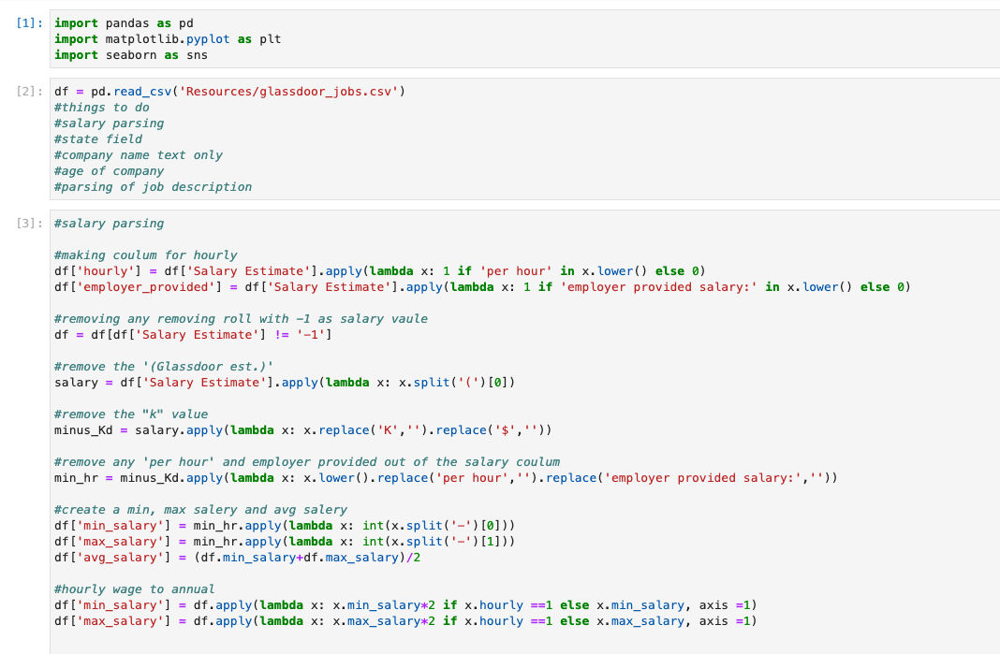
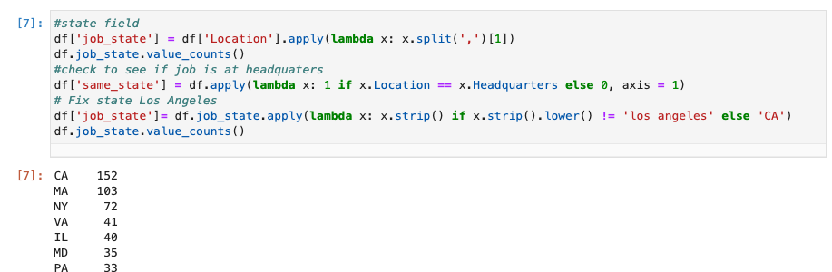
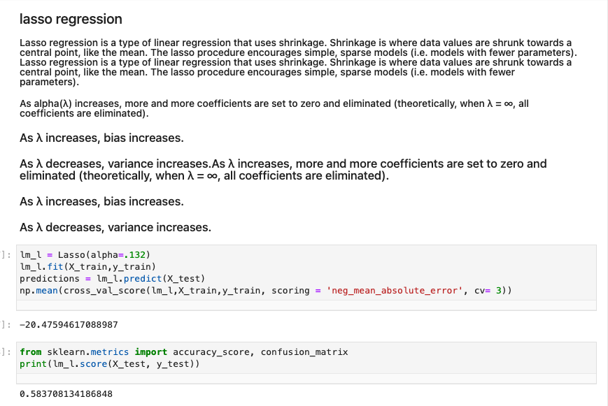
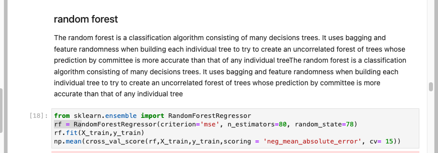
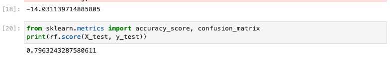

# Salary Analysis of Data Professionals 

## Overview
The topic our team chose deals with the salary ranges for various Data Scientist positions. We chose this topic because all 4 of our team members are either working in the data science field or potentially transfering to the field. Hopefully, this data analysis will help our team, and others, find answers that will determine the next steps they should take in their data science career.

#### About the dataset
  The original dataset being used in our project was collected by Glassdoor and plushed to [Kaggle](https://www.kaggle.com/datasets/jackogozaly/data-science-and-stem-salaries).In addition to our original dataset, we have added a dataset called "data science and STEM Salaries". 

## Team Roles
- Square: Reid Vogel will be responsible for our teams repository.
- Triangle: Fritz is responsible for the machine learning model. 
- Circle: Megan Willard is responsible for creating and maintaining our teams databases. 
- X: Gabe Barletta is responsible for deciding which technologies to use for each step. 

## Communication Protocols
Our team's main source of communication is through slack. We have scheduled zoom meetings every Tuesday and Thursday from 7pm to 9pm eastern. We schedule additional meetings through our slack group message. Prior to pushing data to the main and deleting/adding branches, team members review the accuracy of the data and ensure branches are up-to-date. 

## Cleaning the dataset

There were quite a few things that needed to be clean in order to propery anlyize this data. 

* First we cleaned salary colunm by 
    - Removed all rolls with -1 
    - remove all the text in the colunm 
    - Created a min and max coulmn then made an avergae column out of       the two 
    - Then converted all hourley pay in salery

* Cleaning the Location cloumn
    - Corrected the Los Angeles erro and included it in the state of California 

* We also wanted to parse through the Job description couln to make columns for certains skills the these postions requried 

## Database development

We compared the two data sets and found that there were several column categories in common. These columns would need to be the focus of the joins. 

  The below graphic shows the columns that were similar between the datasets.

Both data sets was loaded into SQL using sqlAlchamey. 
A primary key field was added to both sets and the 4 columns in common were combined using a Union statement. The corresponding data was combined using a Left Join. 

SQLAlchemy was then used to load two data sets back into a data frame in a jupyter notebook. One that just had the four columns in common and 1 that had all of the data. 

## Model Building overview
In deveolopeming the machine learn model there a couple of major factors we had to consdier. We took a deeper dive into the data main columns that will help us preditc a salary. they are type of ownership, sector, seniority level of the postion and certains skill sets

First, we transformed the categorical variables into dummy variables. Then we  split the data into train and tests sets with a test size of 20% using sklearn.model train_test_split.

I tried three different models and evaluated them using Mean Absolute Error. I chose MAE because it is relatively easy to interpret and outliers aren’t particularly bad in for these type of models.

I tried three different models:

Multiple Linear Regression – Baseline for the model

Lasso Regression – Because of the sparse data from the many categorical variables, I thought a normalized regression like lasso would be effective.

Random Forest – Again, wbecause of the sparsity associated with the data, I thought that this would be a good fit.

#### Preliminary data

The preliminary data was scraped from levels.fyi and glassdoor where it was then uploaded to [Kaggle](https://www.kaggle.com/datasets/jackogozaly/data-science-and-stem-salaries). It had over 50,000 different salary records from top compaines. The data from [Levels](https://www.levels.fyi/?compare=Citrix,Microsoft,Amazon&track=Software%20Engineer) gave use tons of information from current or ex workers that we consider using for our machine learning model such as type of company, total yearly pay,job location etc.  

Using these two datasets would be the best way to maximized accuracy. After future cleaning the Data sets we get the dataframe seen below as our new data set that will be used to traing the models we will test out.

#### Train test split
The new Dataframe was made machine learning ready by encoding it with getdummies Then we split the data into train and tests sets with a test size of 20% using sklearn.model train_test_split.

## Model performance

### Multiple Linear Regression
 For our base we chose to do a multiple Linear regression model using stats models.api we can see the models perfmance after fitting it with the training and testing  sets
 
 
 we see that R-squared accuracy raiting is only 63%, we beleve we can do better and tighen things up so we  move one to a different model 
 
### Lasso Regression

Although the Lasso Regression model had a much beeter Mean absolute error (MAE) of being just $20,000 off the prediction value the Accuracy score was still not good enough as it was only a 58%

### Random Forest

 
 
 
 

## Model Acuracy 
when comparing all three models we decieded to go with the best performing model which is the Random forest regression model

From the analysis of each method the Random forest regression models have the greatest predictive accuracy 

* Multiple Linear Regression: = 40%
* Lasso Regression: = 58% 
* Random Forest:  = 79%

## Prediction

we created a web page to allow user to iinput creatin information which will be severed to the machine learning model to then give salary prdictiong base on the input information 

(insert link here)

Along with our prediction caculater you will find all information extracted from these data settins allowing users to further looking into the data. 

## Dashboard development
Our Dashboard currently consists of 6 visualizations that were created using Tableau. Below you can find our Tableau storyboard, images of the visualizations, and links to access the visualizations. 

#### Tableau Storyboard
https://public.tableau.com/app/profile/reid.vogel/viz/DataSalariesStoryboard/DataScientistSalaries

#### Visualizations
- Salaries Per Position bar chart: https://public.tableau.com/app/profile/reid.vogel/viz/AvgSalaryperPosition/AvgSalaryperPosition

- Count of Position Hires bar chart: https://public.tableau.com/app/profile/reid.vogel/viz/NumberofHiresperPosition/NumberofHiresperPosition

- Highest Paying Companies bar chart: https://public.tableau.com/app/profile/megan.willard1550/viz/SalarybyCompany/Sheet3

- Salaries per Location Heatmap: https://public.tableau.com/app/profile/megan.willard1550/viz/SalaryHeatMap/Sheet1

- Salaries per sector: https://public.tableau.com/app/profile/megan.willard1550/viz/DataSalariessector/Sheet1

- Salaries vs Revenue: https://public.tableau.com/app/profile/megan.willard1550/viz/SalaryandRevenue/Sheet1

## Presentation
Our presentation is available through the following link:
https://docs.google.com/presentation/d/1fSWGhl2xTozmtblOBTLWxI3q0nlmSoqF4lLhkz6ujpQ/edit?usp=sharing

Our story board is available through the following link:
https://docs.google.com/presentation/d/1Qyj2e5KKToX0qI48rrzPFEZkz3QcQ_HNPzj0oSZePhg/edit#slide=id.g11dccfb9e8f_0_10
